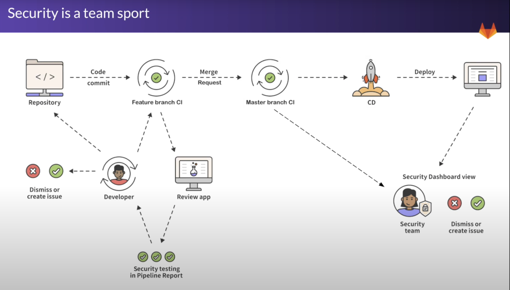
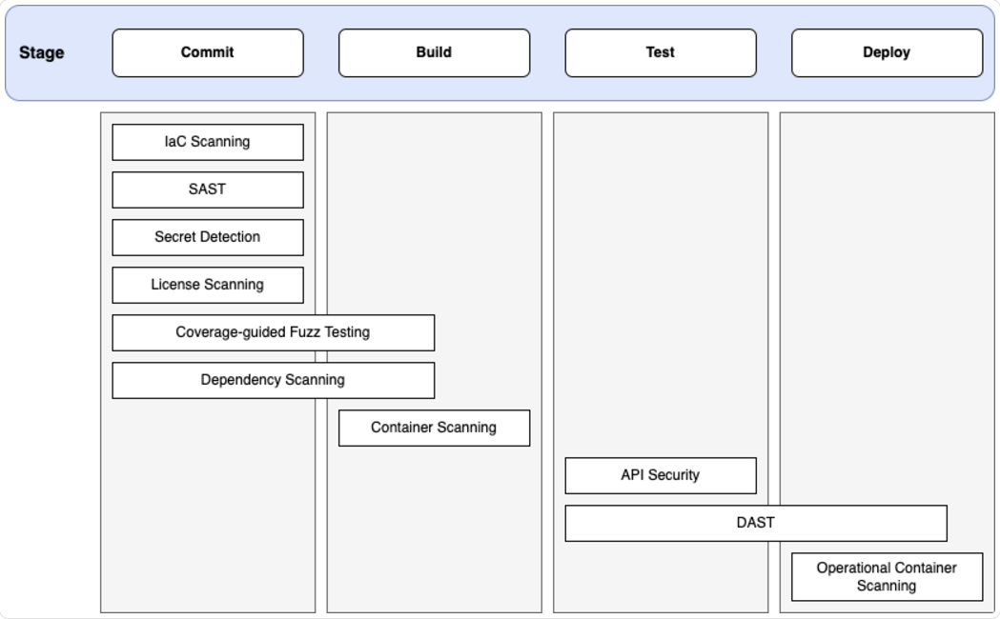

# examprep-gitlab

---
# 1. Introduction
## 1.1. Purpose

This document describes the exam preparation for GitLab that is provided for Manager and DevSecOps.

## 1.2. Audience

The audience for this document includes:

* DevSecOps who will learn, understand and apply any GitLab knowledge from GitLab University and other courses.

* Manager who will manage, renew, or cancel a SaaS subscription to any courses.

---
# 2. System Overview
## 2.1. Benefits and Values

## 2.2. Ultimate Offerings

### 2.2.1 Static Application Security Testing (SAST)

|                            Feature                            | Free & Premium | Ultimate |
|:-------------------------------------------------------------:|:--------------:|:--------:|
|           Basic scanning with open-source analyzers           |      Yes       |   Yes    |
|                 Downloadable SAST JSON report                 |      Yes       |   Yes    |
| Cross-file, cross-function scanning with GitLab Advanced SAST |       No       |   Yes    |
|             New findings in merge request widget              |       No       |   Yes    |
|          New findings in merge request changes view           |       No       |   Yes    |
|                   Vulnerability Management                    |       No       |   Yes    |
|                UI-based scanner configuration                 |       No       |   Yes    |
|                     Ruleset customization                     |       No       |   Yes    |
|                Advanced Vulnerability Tracking                |       No       |   Yes    |

## 2.3. Security



## 2.4. Limitations

* Dependency Scanning
  - Supports Python version `3.11` only.

---
# 3. User Personas
## 3.1 RACI Matrix

|            Category            |                      Activity                       | DevSecOps | Manager |
|:------------------------------:|:---------------------------------------------------:|:---------:|:-------:|
| Installation and Configuration |    Specify a remote ruleset in a CI/CD variable     |    R,A    |         |
| Installation and Configuration |     Enable secret push protection in a project      |    R,A    |         |
|        CI Configuration        |   Commit: Customize built-in source code analysis   |    R,A    |         |
|        CI Configuration        |   Commit: Customize built-in dependency analysis    |    R,A    |         |
|        CI Configuration        |   Build: Customize built-in source code analysis    |    R,A    |         |
|        CI Configuration        |    Build: Customize built-in container analysis     |    R,A    |         |
|        CI Configuration        | Deploy: Customize built-in web application analysis |    R,A    |         |
|        CI Configuration        |              Specify a remote ruleset               |    R,A    |         |
|   Monitoring and Compliance    |           View results of security scans            |    R,A    |         |

---
# 4. Prerequisites
## 4.1. GitLab Account

* [GitLab University][c01]

## 4.2 Developer Workstation

---
# 5. Installation and Configuration
## 5.1. Specify a remote ruleset in a CI/CD variable

This runbook should be performed by the DevSecOp.

1. Navigate to GitLab > Select your group > Settings > CI/CD.
2. Add the following **Variables**.
  * `SAST_RULESET_GIT_REFERENCE`: `<GITLAB_PATH>@<GIT_SHA>`.
  * `SECURE_ENABLE_LOCAL_CONFIGURATION`: `false`.

A remote configuration file will not apply its customizations correctly, if any:
  * `SECURE_ENABLE_LOCAL_CONFIGURATION` variable is not set AND a local `.gitlab/sast-ruleset.toml` file exists.
  * The remote ruleset file is in a repository location that requires authentication.

## 5.2. Enable secret push protection in a project

This runbook should be performed by the DevSecOp.

On GitLab Self-managed instances, secret push protection must be enabled for the **entire instance**. Then, you must enable it per project.

You must have at least the **Maintainer** role for the project.

1. Navigate to GitLab > Select your project > Secure > Security configuration.
2. Turn on the **Secret push protection** toggle.

---
# 6. CI Configuration

**Application Security Tools Per Stage**



## 6.1. Commit: Customize built-in source code analysis

This runbook should be performed by the DevSecOp.

GitLab SAST supports scanning a variety of programming languages and frameworks. After you enable SAST, the right set of analyzers runs automatically even if your project uses more than one language.

|        Language         |             Analyzer              | GitLab Version |
|:-----------------------:|:---------------------------------:|:--------------:|
| Java (any build system) | Semgrep with GitLab-managed rules |     14.10      |
|     Java (Android)      | Semgrep with GitLab-managed rules |     16.11      |
| Java (any build system) |           Advanced SAST           |      17.3      |
|       JavaScript        | Semgrep with GitLab-managed rules |     13.10      |
|       JavaScript        |           Advanced SAST           |      17.3      |
|  Kubernetes manifests   |              Kubesec              |      12.6      |
|         Node.js         | Semgrep with GitLab-managed rules |     16.11      |
|         Node.js         |           Advanced SAST           |      17.3      |
|         Python          | Semgrep with GitLab-managed rules |      13.9      |
|         Python          |           Advanced SAST           |      17.3      |
|          React          | Semgrep with GitLab-managed rules |     13.10      |
|       TypeScript        | Semgrep with GitLab-managed rules |     13.10      |
|       TypeScript        |           Advanced SAST           |      17.3      |

1. Open the `.gitlab-ci.yml` file in your editor.
2. Add the following configuration.

```yml
include:
  - template: Jobs/SAST.gitlab-ci.yml
  - template: Jobs/Secret-Detection.gitlab-ci.yml

variables:
  GITLAB_ADVANCED_SAST_ENABLED: true
  SAST_RULESET_GIT_REFERENCE: "gitlab.com/example-group/example-ruleset-project"
  SECRET_DETECTION_RULESET_GIT_REFERENCE: "gitlab.com/example-group/remote-ruleset-project"

brakeman-sast:
  variables:
    SAST_ANALYZER_IMAGE_TAG: "3.1.1"

semgrep-sast:
  variables:
    SAST_ANALYZER_IMAGE_TAG: "3.7"
```

## 6.2. Commit: Customize built-in dependency analysis

This runbook should be performed by the DevSecOp.

The [GitLab Advisory Database][c02] is the source of vulnerability data used by the `gemnasium`, `gemnasium-maven`, and `gemnasium-python` analyzers. The Docker images of these analyzers include a clone of the database.

The clone is synchronized with the database before starting a scan. In an offline environment, you must host the database somewhere that is accessible by `HTTP` from the GitLab runners.

The following languages and dependency managers are supported by Dependency Scanning.

|         Language          |        Language Versions         | Package Manager |                 Supported Files                  | Processes Multiple Files |
|:-------------------------:|:--------------------------------:|:---------------:|:------------------------------------------------:|:------------------------:|
|      Java and Kotlin      | 8 LTS, 11 LTS, 17 LTS, or 21 LTS |     Gradle2     |          build.gradle, build.gradle.kts          |            N             |
|                           |                                  |     Maven6      |                     pom.xml                      |            N             |
| JavaScript and TypeScript |           All versions           |       npm       |      package-lock.json, npm-shrinkwrap.json      |            Y             |
|                           |                                  |      yarn       |                    yarn.lock                     |            Y             |
|                           |                                  |      pnpm3      |                  pnpm-lock.yaml                  |            Y             |
|          Python           |               3.11               |   setuptools    |                     setup.py                     |            N             |
|                           |                                  |       pip       | requirements.txt, requirements.pip, requires.txt |            N             |
|                           |                                  |     Pipenv      |              Pipfile, Pipfile.lock               |            N             |
|                           |                                  |     Poetry4     |                   poetry.lock                    |            N             |

1. Open the `.gitlab-ci.yml` file in your editor.
2. Add the following configuration.

```yml
include:
  - template: Jobs/Dependency-Scanning.gitlab-ci.yml

variables:
  GEMNASIUM_DB_REMOTE_URL: https://users-own-copy.example.com/gemnasium-db.git

gemnasium-dependency_scanning:
  variables:
    DS_REMEDIATE: "false"
```

## 6.3. Build: Customize built-in source code analysis

This runbook should be performed by the DevSecOp.

Most GitLab SAST analyzers directly scan your source code without compiling it first. However, for technical reasons, the **SpotBugs**-based analyzer scans *compiled bytecode*.

By default, the **SpotBugs**-based analyzer automatically attempts to fetch dependencies and compile your code so it can be scanned. However, automatic compilation may fail on certain conditions, and you may want to skip the analyzer's compilation step and directly provide artifacts from an earlier stage in your pipeline instead.

1. Open the `.gitlab-ci.yml` file in your editor.
2. Add the following configuration.

```yml
stages:
  - build
  - test

include:
  - template: Jobs/SAST.gitlab-ci.yml

build:
  image: maven:3.6-jdk-8-slim
  stage: build
  script:
    - mvn package -Dmaven.repo.local=./.m2/repository
  artifacts:
    paths:
      - .m2/
      - target/

spotbugs-sast:
  dependencies:
    - build
  variables:
    MAVEN_REPO_PATH: $CI_PROJECT_DIR/.m2/repository
    COMPILE: "false"
  artifacts:
    reports:
      sast: gl-sast-report.json
```

---
# 8. Monitoring and Compliance
## 8.1. View results of security scans

This runbook should be performed by the DevSecOp.

Viewing results of security scans depend on workflow.

| #  |        Where?        |                                  What Does It Show?                                  |
|:--:|:--------------------:|:------------------------------------------------------------------------------------:|
| 01 | Vulnerability report |                         Vulnerabilities on `default` branch                          |
| 02 |   Pipeline details   |                         Vulnerabilities on `pipeline` branch                         |
| 03 |    Merge request     |         Vulnerabilities on `pipeline` branch but NOT on `default` branch; OR         |
|    |    Merge request     |                     Vice versa (shows the delta between the two)                     |
| 04 |     List reports     | **Dependency List** - as detected by *dependency scanning* and *container scanning*. |
|    |     List reports     |            **License Compliance** - as detected by *dependency scanning*.            |

All reports who all results by all scanners.
* Each report location show problems found by all scanners.
* User can filter vulnerabilities by scanner.
* The information provided for each report type is subtly different.

---
# 9. References

The following resources were used as a single-use reference.

|                       Title                       | Type | Author |
|:-------------------------------------------------:|:----:|:------:|
|       [Ultimate: Application Security][r01]       | Docs | GitLab |
| [Static Application Security Testing (SAST)][r02] | Docs | GitLab |
|            [Offline Environments][r03]            | Docs | GitLab |

[c01]: https://university.gitlab.com/learn/dashboard
[c02]: https://gitlab.com/gitlab-org/security-products/gemnasium-db
[r01]: https://docs.gitlab.com/ee/user/application_security/
[r02]: https://docs.gitlab.com/ee/user/application_security/sast/index.html
[r03]: https://docs.gitlab.com/ee/user/application_security/offline_deployments/